<div align="center">




<br />
<br />


</div>

---

## About Me

I'm an IT professional with **7 years of experience in IT and technical support**, currently focusing my career on **Full-Stack Web Development**.

My background in technical support has helped me develop strong problem-solving, troubleshooting, root-cause analysis, documentation, and communication skills. I'm now applying those skills to software development by building practical web applications and strengthening my knowledge of frontend, backend, databases, and APIs.

I'm continuously learning and improving my skills in modern web technologies while building projects that solve practical, real-world problems.

- 💻 Currently focusing on **Full-Stack Web Development**
- 🌐 Building applications with **Frontend + Backend + Database**
- ⚛️ Strengthening my **React.js** skills
- 🟢 Developing backend applications using **Node.js**
- 🗄️ Working with **MongoDB and database systems**
- 🔌 Learning and building **RESTful APIs**
- 🧠 Applying my IT troubleshooting experience to software development
- 🚀 Goal: Become a professional **Full-Stack Web Developer**

---

## 🛠️ Tech Stack

### 🌐 Frontend

<p align="center">


</p>

---

### ⚙️ Backend & Programming

<p align="center">


</p>

---

### 🗄️ Databases

<p align="center">


</p>

---

### 🧠 Programming Fundamentals

<p align="center">


</p>

---

### 🛠️ Tools & Development

<p align="center">


</p>

---

## 🚀 Full-Stack Development

```text
                    FULL-STACK WEB DEVELOPMENT
                              │
             ┌────────────────┴────────────────┐
             │                                 │
          FRONTEND                           BACKEND
             │                                 │
       ┌─────┴─────┐                     ┌────┴─────┐
       │           │                     │          │
   JavaScript   React.js             Node.js    REST APIs
       │           │                     │          │
       └─────┬─────┘                     └────┬─────┘
             │                                 │
             └──────────────┬──────────────────┘
                            │
                         DATABASE
                            │
                     ┌──────┴──────┐
                     │             │
                  MySQL          MongoDB
                     │             │
                     └──────┬──────┘
                            │
                            ▼
                    WEB APPLICATION 🚀
```

---

# 🚀 Featured Projects

## 🌐 Personal Portfolio

**HTML • CSS • JavaScript**

A personal developer portfolio focused on presenting my skills, projects, experience, and journey into Full-Stack Web Development.

### ✨ Focus Areas

- 🎨 Responsive web design
- 💻 Developer portfolio
- 🧩 Interactive UI
- 📱 Responsive layouts
- ⚡ JavaScript interactions
- 🚀 Project showcase

### 🖼️ Screenshot

### 🔗 Links

[](https://github.com/kaedeharakazuha26/portfolio-website)

[](https://kaedeharakazuha26.github.io/portfolio-website/)

---

# 📚 Currently Learning

```text
┌───────────────────────────────────────────────┐
│             CURRENT LEARNING PATH             │
├───────────────────────────────────────────────┤
│                                               │
│  🌐 Frontend Development                      │
│     ├── HTML / CSS                            │
│     ├── JavaScript                            │
│     └── React.js                              │
│                                               │
│  ⚙️ Backend Development                       │
│     ├── Node.js                               │
│     ├── PHP                                   │
│     └── Laravel                               │
│                                               │
│  🔌 API Development                           │
│     └── RESTful APIs                          │
│                                               │
│  🗄️ Database Development                      │
│     ├── MySQL                                 │
│     └── MongoDB                               │
│                                               │
│  🧠 Programming Fundamentals                  │
│     ├── Algorithms                            │
│     └── Data Structures                       │
│                                               │
│  🚀 Full-Stack Application Development        │
│                                               │
└───────────────────────────────────────────────┘
```
# 🧠 Core Skills

| Category | Skills |
| :--- | :--- |
| 🌐 Frontend | HTML5, CSS3, JavaScript, React.js |
| ⚙️ Backend | Node.js, PHP, Laravel |
| 🔌 APIs | RESTful APIs |
| 🗄️ Database | MySQL, MongoDB, DBMS |
| 🧮 Fundamentals | Algorithms, Data Structures |
| 🛠️ Version Control | Git, GitHub |
| 🔧 IT Support | Technical Troubleshooting |
| 🧩 Problem Solving | Root-Cause Analysis |
| 🌐 Networking | Computer Networking |
| 🗂️ Systems | ServiceNow, CRM |

---

# 🔥 What I Bring From IT Support

My transition into Full-Stack Development is built on years of solving technical problems.

```text
IT SUPPORT EXPERIENCE
        │
        ├── 🔍 Troubleshooting
        │
        ├── 🧠 Root-Cause Analysis
        │
        ├── 🧩 Problem Solving
        │
        ├── 📝 Documentation
        │
        ├── 🗂️ Data & Ticket Management
        │
        └── 💬 Technical Communication
                    │
                    ▼
             SOFTWARE DEVELOPMENT
                    │
                    ├── 🌐 Frontend
                    ├── ⚙️ Backend
                    ├── 🗄️ Database
                    └── 🔌 APIs
                    │
                    ▼
          🚀 FULL-STACK DEVELOPMENT
```

# 📊 GitHub Stats

<p align="center">
  
  
</p>

---

# 🔥 GitHub Streak

<p align="center">
  
</p>

---

# 🐍 Contribution Graph

<p align="center">


</p>

---

# 📫 Connect With Me

<p align="center">

<a href="mailto:picar.jhomar@gmail.com">

</a>

<a href="YOUR_LINKEDIN_URL">

</a>

<a href="https://kaedeharakazuha26.github.io/portfolio-website/">

</a>

</p>

<p align="center">

📍 Manila, National Capital Region, Philippines

</p>

---

<div align="center">

### 💻 Build. Learn. Solve. Repeat. 🚀

**Thanks for visiting my GitHub profile!**

</div>
